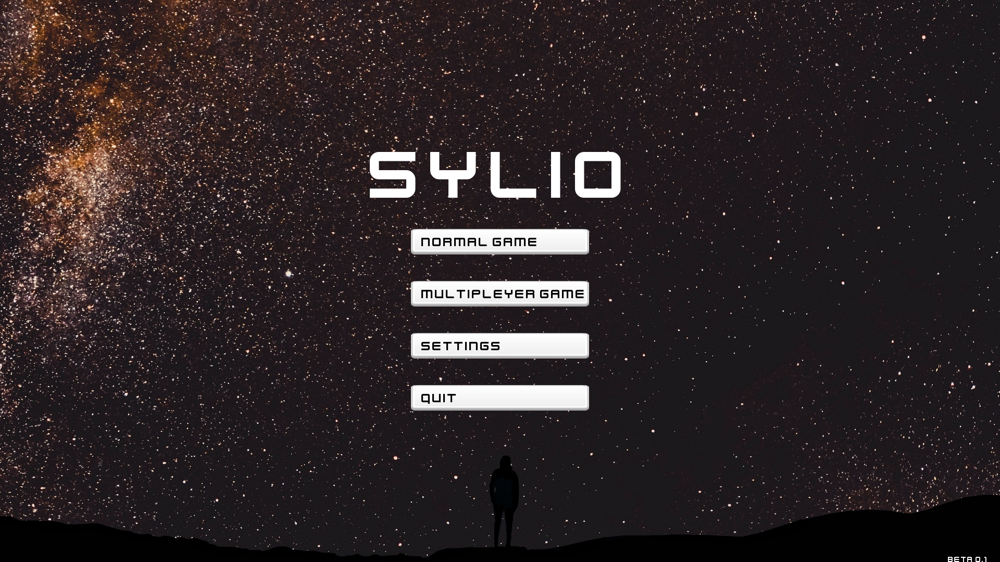
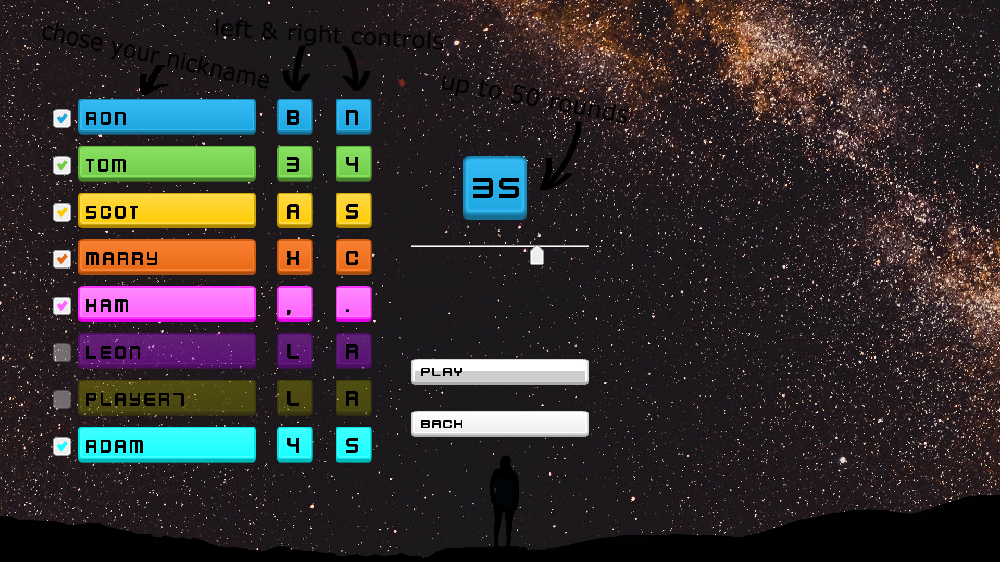
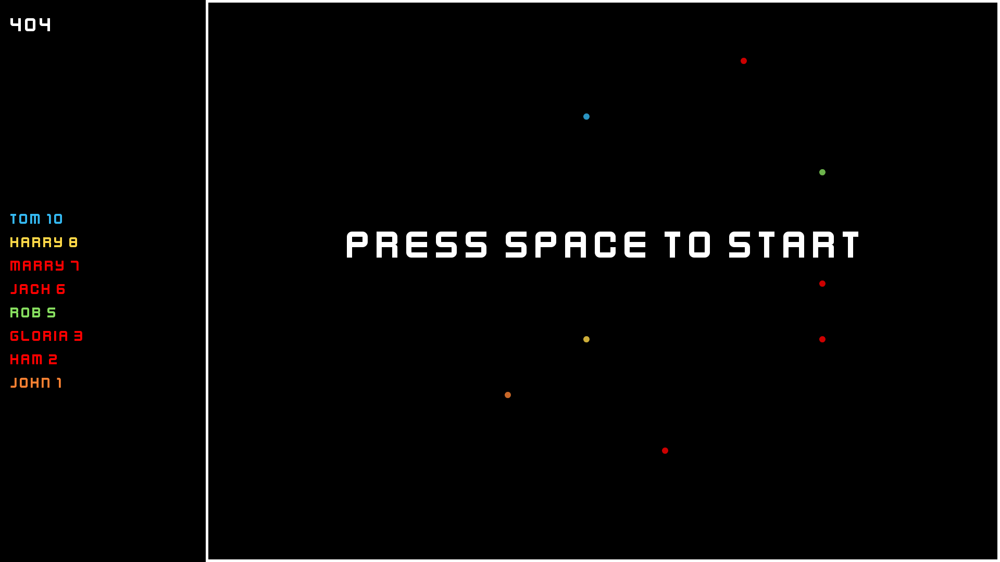
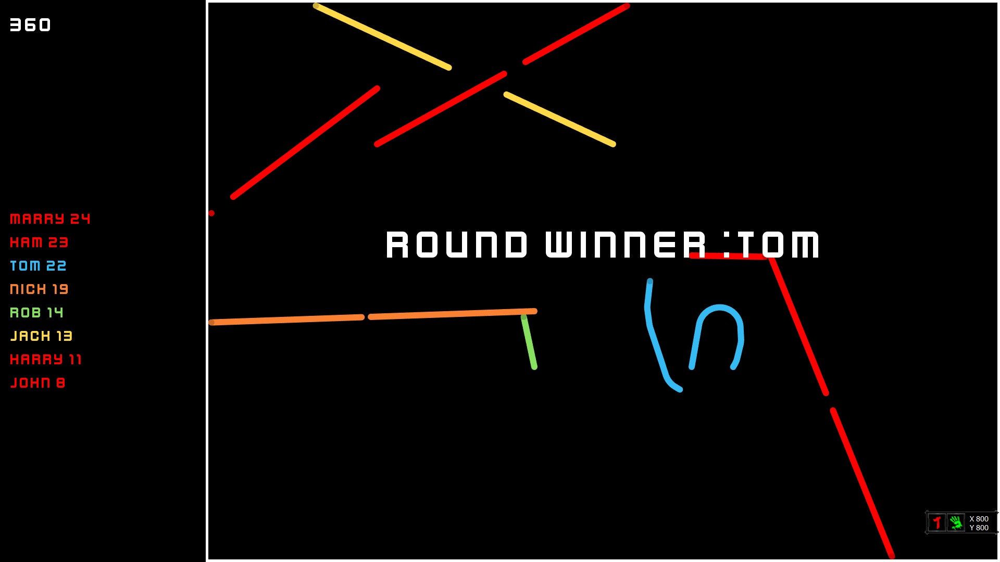
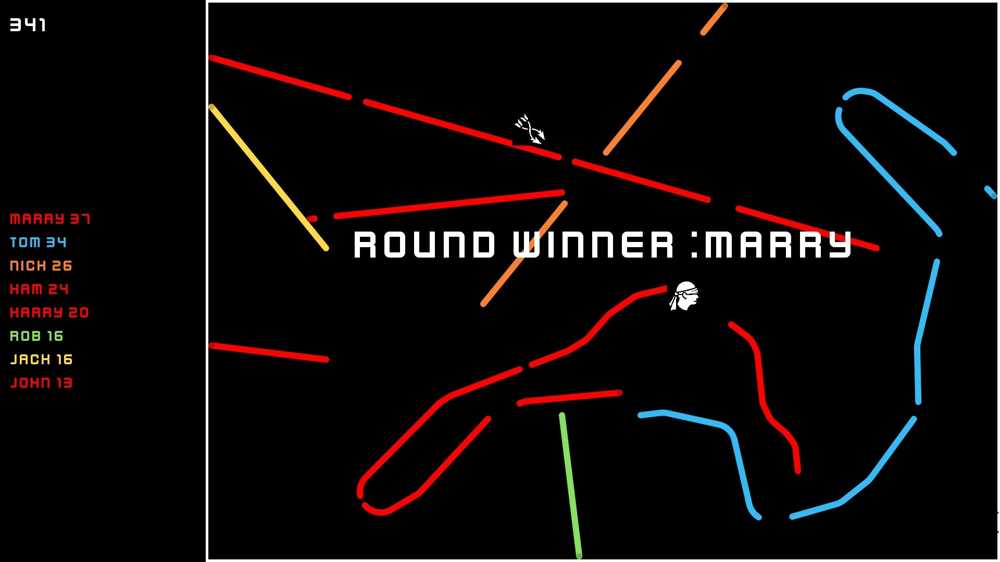

# Sylio

Sylio is simple multiplayer game, up to eight players controls snail and tries to survive as long as it is possible.

## Getting Started

Currently application works only on windows and the best screen resolution is fullHd
If you find any bugs leave feedback

## Screenshots

## Instalator

link to instalator :
https://drive.google.com/drive/folders/1VCkCfbHeYCj8A6g9C8OCWWS_vs863Ih-?usp=sharing

If sylio.exe did not installed properly copy file from link above and paste to YourDir/Release

## Built With

* [Sfml](https://www.sfml-dev.org/) - multi-platform media library

## Authors

***Sylwow***

## License

This project is licensed under the MIT License - see the [LICENSE.md](license.txt) file for details

