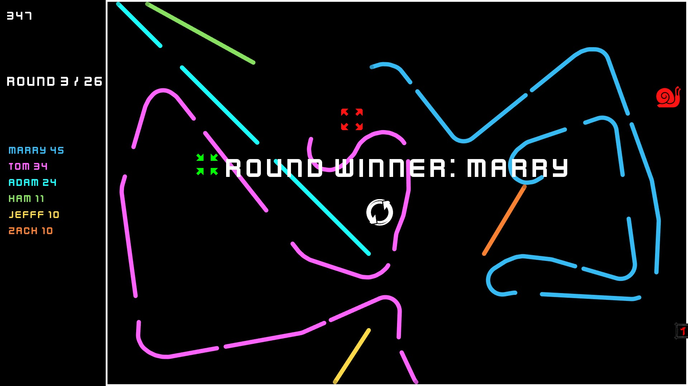
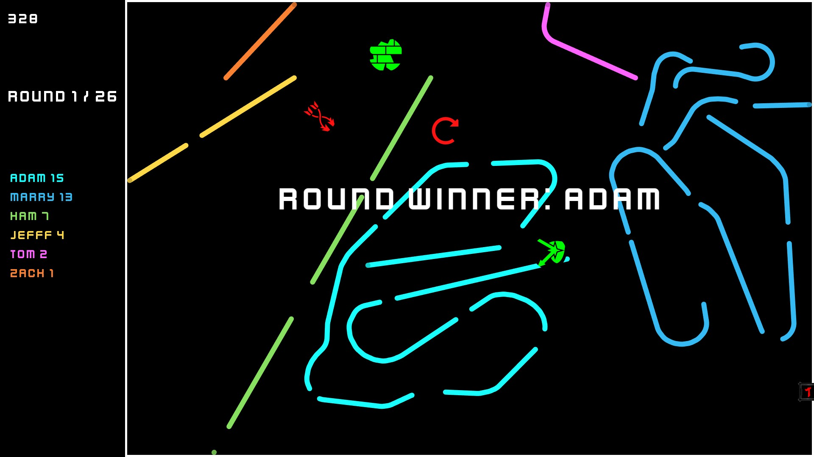

# Sylio
Sylio is simple multiplayer game, up to eight players controls snail and tries to survive as long as it is possible.
## Getting Started
Currently application works only on windows and the best screen resolution is fullHd

If you find any bugs leave feedback
## Screenshots

## Instalator
link to instalator :

https://drive.google.com/drive/folders/1VCkCfbHeYCj8A6g9C8OCWWS_vs863Ih-?usp=sharing

If sylio.exe did not installed properly copy file from link above and paste to YourDir/Release
## Game Description
soon
## Game Rules 
Players die when snail head collide with snail tails or gameboard bounds.

Round is over when only last player is still alive

Player score is update when: player dies or round is over

Points function: points gained for current round = dead players + player segments (visible on board)

Powerups:

  speed up: increases speed by 20%

  slow down: decreases speed by 20%

  blind: make tails invisible

  freeze: freezes player for 5s

  grow up: increase radious by 20%

  shrink: decreases radious by 20%

  lock left: lock left turns

  lock right: lock right turns

  switch controls: switch controls of your snake

Powerups are spawning on board every 10 - 20 sec (random)
## Music
Music creator: Bartosz Twardy

https://soundcloud.com/bartosz-twardy-111728082?fbclid=IwAR0gtAkXr3lYFIJDBXkoVPhbxdpg4p6mamCXlR8p2_QWc7UPwoeV9wzrHgo
## Built With
* [Sfml](https://www.sfml-dev.org/) - multi-platform media library
## Authors
***Sylwow***
## License
This project is licensed under the MIT License - see the [LICENSE.md](license.txt) file for details
